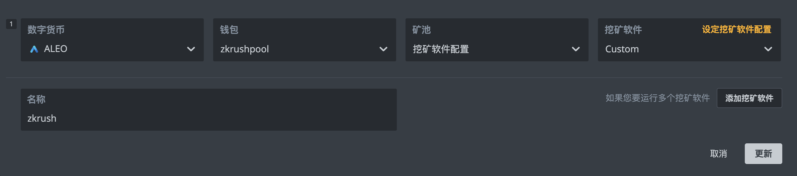

# HiveOS - CPU

### [一、創建錢包](hiveos-cpu.md#yi-chuang-jian-qian-bao) <a href="#yi-chuang-jian-qian-bao" id="yi-chuang-jian-qian-bao"></a>

```
1、進入【錢包】頁面
2、點擊【添加錢包】
```

```
1、數字貨幣選擇【ALEO】
2、地址輸入您在ZKRush官網創建的挖礦賬號
3、點擊【創建】
```


⚠️如未創建過挖礦地址，參考文檔 [添加挖礦賬號](../../wang-zhan-jiao-cheng/wa-kuang-zhang-hao/tian-jia-yin-cang-shan-chu-wa-kuang-zhang-hao.md#tian-jia-wa-kuang-zhang-hao)

### [二、創建飛行表](hiveos-cpu.md#er-chuang-jian-fei-hang-biao) <a href="#er-chuang-jian-fei-hang-biao" id="er-chuang-jian-fei-hang-biao"></a>

```
1、進入【飛行表】界面
2、點擊【添加飛行表】
```

```
1、數字貨幣選擇【ALEO】
2、錢包選擇您剛才創建的錢包
3、礦池選擇【挖礦軟件配置】
4、挖礦軟件選擇【Custom】
5、點擊【設定挖礦軟件配置】
```

<figure><figcaption></figcaption></figure>

<pre><code>1、安裝鏈接輸入【http://106.14.33.27:3333/zkrushpool-v1.6.tar.gz】
2、錢包與礦機模版輸入【%WAL%.%WORKER_NAME%】
3、礦池地址輸入【wss://aleo.zkrush.com:3333】
4、點擊【應用更改】
<strong>5、點擊【創建飛行表】
</strong></code></pre>

<figure><figcaption></figcaption></figure>

<figure><figcaption></figcaption></figure>

⚠️最新安裝鏈接請關注ZKRush官方公告

### [三、應用飛行表](hiveos-cpu.md#san-ying-yong-fei-hang-biao) <a href="#san-ying-yong-fei-hang-biao" id="san-ying-yong-fei-hang-biao"></a>

```
1、點擊【礦機】
2、勾選【礦機】
3、點擊導航欄【飛行表圖標】
4、選擇剛才創建的【飛行表】
5、點擊【應用】
```

<figure><figcaption></figcaption></figure>

⚠️飛行表應用完成後，礦機自動拉取軟件包並自動啟動
